# Card previews

Rendered by `pnpm examples` from the saved cards in [`../cards`](../cards).
Edit one of those files and run `pnpm examples <name>` to redraw just that card.

## contributed-to

The `contributed-to` card from [`cards/contributed-to.json`](../cards/contributed-to.json) — `username=marcalexiei` · `theme=tokyonight` · `repos_count=5` · `exclude_repo=tuono-labs/tuono`

## gist

The `gist` card from [`cards/gist.json`](../cards/gist.json) — `id=1f13e82cb48a9058ebcbf4945f5a1c20` · `show_owner=true` · `theme=tokyonight`

## pin

The `pin` card from [`cards/pin.json`](../cards/pin.json) — `username=marcalexiei` · `repo=rollup-plugin-sass` · `show_owner=true` · `theme=tokyonight`

## stats

The `stats` card from [`cards/stats.json`](../cards/stats.json) — `username=marcalexiei` · `theme=tokyonight` · `show_icons=true` · `show=reviews,prs_merged`

## stats-compact

The `stats` card from [`cards/stats-compact.json`](../cards/stats-compact.json) — `username=marcalexiei` · `custom_title=Marco, in short` · `hide=issues,contribs` · `hide_rank=true` · `card_width=380` · `text_bold=false`

## top-langs

The `top-langs` card from [`cards/top-langs.json`](../cards/top-langs.json) — `username=marcalexiei` · `layout=compact` · `langs_count=8` · `theme=tokyonight`

## top-langs-donut

The `top-langs` card from [`cards/top-langs-donut.json`](../cards/top-langs-donut.json) — `username=marcalexiei` · `layout=donut` · `langs_count=6` · `hide=html,css` · `theme=radical`

## wakatime

The `wakatime` card from [`cards/wakatime.json`](../cards/wakatime.json) — `username=ffflabs` · `layout=compact` · `langs_count=6` · `theme=tokyonight`
